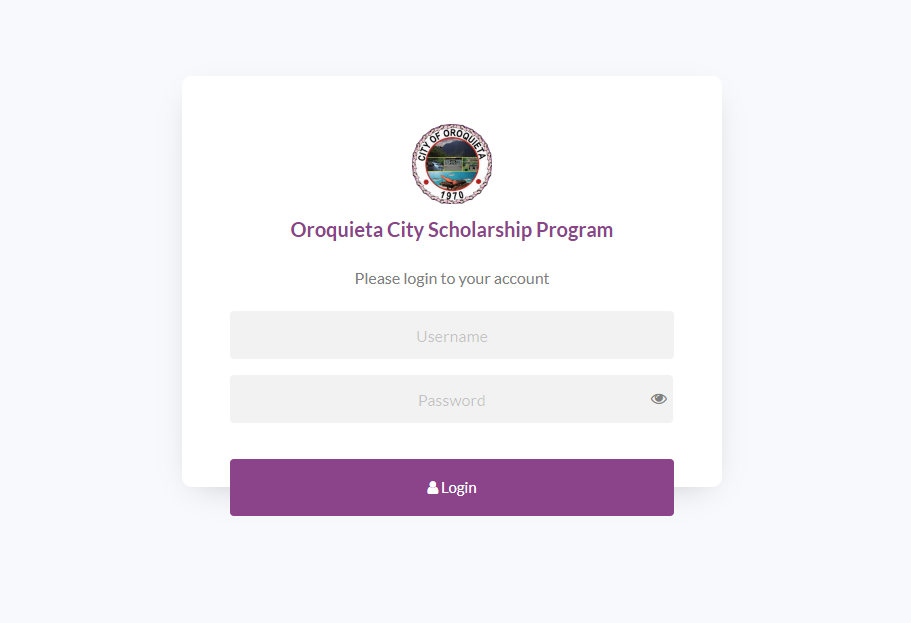

# Oroquieta City Scholarship Program




The Oroquieta City Scholarship Program is a system designed to manage the awarding and distribution of scholarships to eligible students in the city. The system allows for the insertion of new scholarship applicants, with their status set to pending until reviewed by program administrators. Applicants can be approved or disapproved based on their eligibility and other criteria.

The system is capable of generating total counts of applicants for senior high, college, and TVET programs. It can also determine the number of applicants by gender and by address. Additionally, the system can generate a count of applicants based on their school.

The Oroquieta City Scholarship Program includes an automated reporting system and an automated payroll system, streamlining the process of managing scholarships for both administrators and recipients. Schools can also use the system to view the application details of their students.

Overall, the Oroquieta City Scholarship Program is an efficient and effective system for managing scholarships, helping ensure that eligible students have access to financial support for their educational goals.


## Getting started

```
$ git clone https://github.com/johncris09/oroqscholarship.git

-- or -- 

download it manually

Then run this command:

$ composer install
$ composer update

```

## Created with

The Oroquieta City Scholarship Program is a web-based system that is created using a combination of technologies including:
* CodeIgniter 4 - https://codeigniter.com/user_guide/intro/index.html
* CodeIgniter Shield (authentication) - https://github.com/codeigniter4/shield
* Bootstrap 5 - https://getbootstrap.com/docs/5.0/getting-started/introduction/
* jQuery - https://jquery.com/ 
* Datatables - https://datatables.net/
* Datatables - https://datatables.net/
* SweetAlert2 - https://sweetalert2.github.io/
* ApexChart.js - https://apexcharts.com/
* AJAX - https://www.tutorialspoint.com/ajax/what_is_ajax.htm
* MySQL - https://www.mysql.com/ 
* Material Design Icons - https://pictogrammers.github.io/@mdi/font/2.0.46/
* Font Awesome - https://fontawesome.com/

Together, these technologies provide a solid foundation for building a robust and reliable web-based system and ensures that the Oroquieta City Scholarship Program is fast, efficient, and scalable, making it suitable for managing the scholarship program's needs. Additionally, this combination of technologies provides the necessary security features to protect the data stored and accessed by the system.
